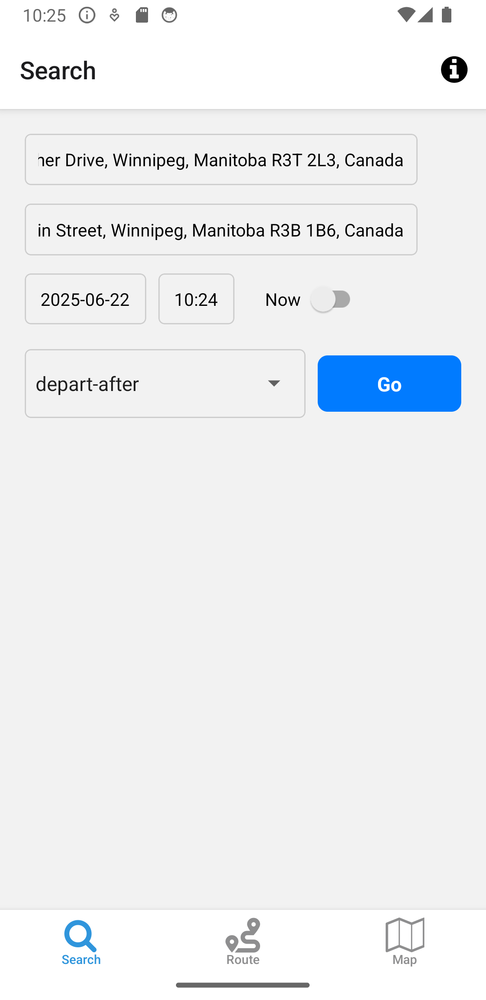
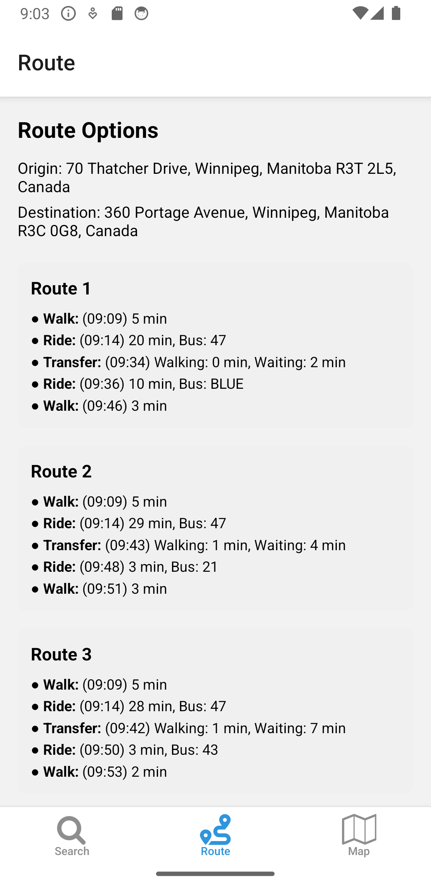
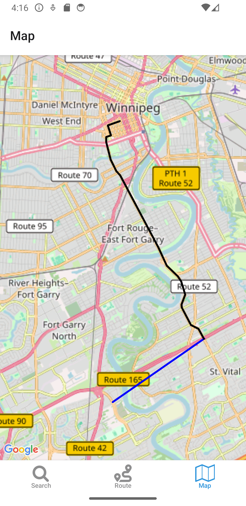

This is a placeholder of the mobile version of winnipeg bus trip planner. The project is built with React Native.
Currently Winnipeg Bus Transit is undergoing a bus routes change, the API might not work as expected.
Web version: https://github.com/pricezhang42/Commute-Compass-Vercel





---
### Development Notes:

Set up enviornment:
https://docs.expo.dev/get-started/set-up-your-environment/?mode=development-build&buildEnv=local

Create a development build:
https://docs.expo.dev/develop/development-builds/create-a-build/

Initialized an expo project:
```npx expo init```

Note: Don't use a very deep project path, the length limit is 100.