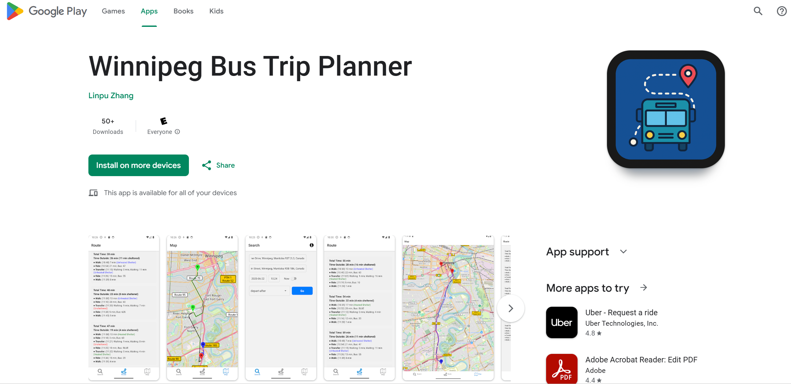
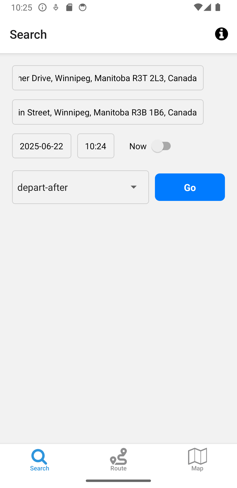
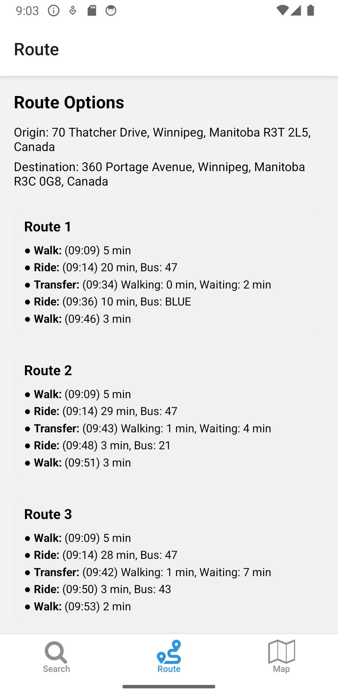
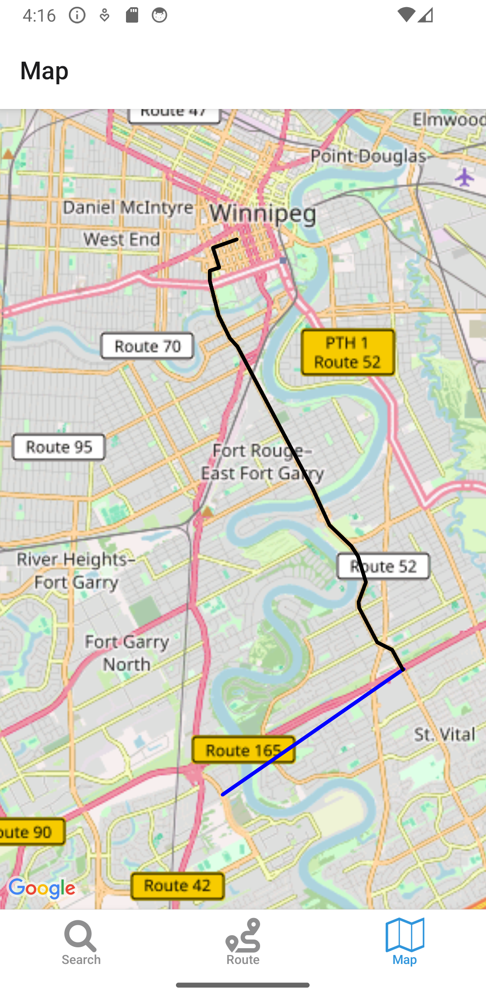

**Winnipeg Bus Trip Planner** is a cross-platform transit app designed to help commuters in Winnipeg easily plan, visualize, and navigate their bus routes. Built using React Native, this mobile app talks to a small companion backend ([BusTripPlanner-backend](../BusTripPlanner-backend)) that proxies the Winnipeg Transit API and Mapbox geocoding and serves bus-route polylines from the Winnipeg Transit GTFS feed.

- Android version is availiable on Google Play -> Search **Winnipeg Bus Trip Planner** or go to:  https://play.google.com/store/apps/details?id=com.anonymous.BusTripPlanner&pcampaignid=web_share

### Key Features
🔍 Smart Trip Planning
- Input origin, destination, date, time, and travel mode to generate multiple route options.

- Automatically fetches and displays detailed trip plans using Winnipeg Transit’s official trip-planner API (via the backend).

- Provide total **waiting time outside** and **sheltered time** for each trip to improve winter travel exprience.

🗺️ Interactive Route Maps
- View the entire bus ride on a map, including bus lines, ride segments, and walk transfers.

- Route polylines come from the Winnipeg Transit **GTFS feed** (`shapes.txt`), sliced to the exact segment between your boarding and alighting stops. OpenStreetMap tiles underlay the map for high-accuracy visuals.

Each ride is highlighted with different colors for clarity.

🚏 Stop Shelter Detection
- Integrates Winnipeg Transit stop features to indicate if a stop has a:

    ✅ Heated Shelter

    🟦 Unheated Shelter

    ⛔ Unsheltered

 - Displays **shelter information** next to walking or transfer segments, improving comfort planning in harsh weather.

 WBTP is currently undergoing closed test in Google Play.

Web prototype version: https://github.com/pricezhang42/Commute-Compass-Vercel

### Architecture

- **App (this repo)** — Expo / React Native client. No upstream API keys are bundled with the app; all third-party calls are proxied by the backend.
- **Backend ([BusTripPlanner-backend](../BusTripPlanner-backend))** — Node + Hono service that holds the Mapbox and Winnipeg Transit credentials, batches the trip-planner + shelter-feature calls, and serves GTFS-based polylines.

Point the client at a backend by setting `EXPO_PUBLIC_BACKEND_URL` at build time, or edit the default in [constants/Backend.ts](constants/Backend.ts). Defaults target `http://10.0.2.2:8787` on Android emulators and `http://localhost:8787` elsewhere.

The only credential still on the client is the **Google Maps Android API key** in [app.json](app.json), used by the native Google Maps SDK. Restrict it in the Google Cloud Console to the app's package name (`com.anonymous.BusTripPlanner`) + release signing SHA-1, and limit it to the **Maps SDK for Android** API.

### Accounts (Supabase)

Search and Map remain available to guests. The Account tab supports email/password
signup, sign-in, sign-out, email confirmation, and password recovery.

1. Create a Supabase project. In Authentication → Providers, enable Email and
   email confirmation. Set the minimum password length to at least 8.
2. Copy `.env.example` to `.env.local`. Set `EXPO_PUBLIC_SUPABASE_URL` and
   `EXPO_PUBLIC_SUPABASE_PUBLISHABLE_KEY` to the project URL and publishable key
   (a legacy anon key also works). Never put a secret/service-role key in the app.
3. In Authentication → URL Configuration, allow both exact redirects:
   - `bustripplanner://auth/callback`
   - `bustripplanner://auth/callback?recovery=true`
   For web development also allow the corresponding URLs at your actual web
   origin, for example `http://localhost:8081/auth/callback` and the same URL
   with `?recovery=true`.
4. Keep the default confirmation/recovery email templates using `{{ .ConfirmationURL }}`.
   Configure a production SMTP provider before opening signup to real users;
   Supabase's default mail service restricts recipients and sending volume.
5. Run `npm ci` and `npm run android`. SecureStore is a new native dependency,
   so rebuild an existing development client once. After environment changes,
   restart Metro with `npx expo start --dev-client --clear`.

Email links use PKCE: open them on the same device/browser that requested them.
On an emulator, open the email link inside the emulator browser. An expired,
reused, or cross-device link displays a recoverable error on the callback screen.
Without Supabase configuration, Account displays an unavailable message while
trip planning continues to work. Native sessions use chunked Expo SecureStore;
web sessions use browser localStorage. Passwords are never stored by the app.

Authentication does not make the transit backend private. Before adding saved
trips or other user data, enforce verified access tokens and per-user authorization
on the backend (and RLS for any client-accessible Supabase tables).

Manual verification with a configured project:
- As a guest, open Search and Map, including with Supabase configuration absent.
- Create an account, open its confirmation email in the same device, and sign in.
- Check invalid credentials, mismatched passwords, and network failure messages.
- Restart the app and confirm the account session persists; sign out and restart.
- Request password recovery, open the email, set a new password, and sign in again.
- Open an expired/reused link and visit `/auth/reset-password` while signed out.
- Verify dark mode, keyboard layout, and Search/Map navigation after login/logout.

References: [Supabase React Native auth](https://supabase.com/docs/guides/auth/quickstarts/react-native)
and [mobile email links](https://supabase.com/docs/guides/auth/native-mobile-deep-linking).

### Favorite locations, favorite trips, and history

Run `supabase/migrations/202609250001_saved_places_and_trips.sql` once in your
Supabase project's SQL Editor before using saved items. The public client key
cannot create tables or apply migrations. This creates three tables with row
level security and a signed-in-only `record_planned_trip` function. The function
uses the authenticated user's ID, serializes concurrent history writes, and
retains exactly the most recent 10 records. No transit backend changes are needed.

- Tap either location field to see favorite locations. Typing hides favorites;
  normal geocoding starts at three characters. Clearing shows favorites again.
- Tap an outlined red heart beside a location to save it, or a filled heart to
  remove it. Tapping the heart does not choose that location.
- The history icon beside Origin opens the last 10 successful searches.
- The red heart beside Destination opens favorite trips. Selecting a trip fills
  both fields; press Go to search with the current date/time settings.
- After a search returns routes, “Save Trip to Fav” saves the searched endpoints.
  Repeated searches create history entries; duplicate favorites are prevented by
  per-user database keys based on endpoint coordinates. Reverse trips are distinct.
- Guests can plan trips; personal list actions prompt sign-in. Failed or empty
  route searches are not saved. Saved-data failures do not prevent trip planning.

After applying the migration, verify with two accounts that neither can read or
modify the other's rows. Plan 11 successful trips and confirm history contains
10 records, including after restarting the app. Also check favoriting a location
from either input, typed-query behavior, favorite removal, offline errors, and
restoring both endpoints from each trip popup.

### Expanded trip itineraries

Use the chevron on the right of a search-result card to expand its itinerary.
Several cards can stay open for comparison. View Map is a separate action;
expanding never navigates away. New search results reset expanded cards.

The timeline shows planned Winnipeg times, stop names/numbers, route and variant
names when supplied, ride durations, transfer walking/waiting, and shelter details.
Walking uses dotted connectors and rides use solid connectors. Dates appear when
an itinerary crosses midnight. Missing times or stop details are labeled rather
than guessed. Ride endpoints can come from immediately adjacent walk/transfer
segments, as in the Transit API. Route badge colors identify legs and are not
claimed to be official route colors. Reliability estimates are not included yet;
RideDetails provides the component where they can later be displayed.
