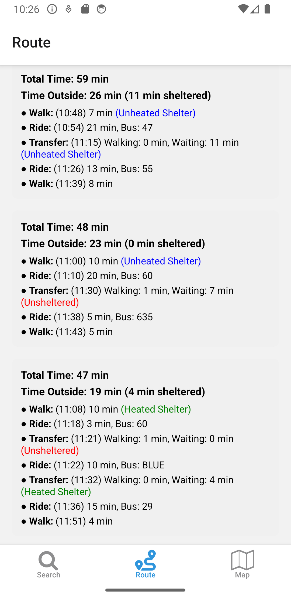
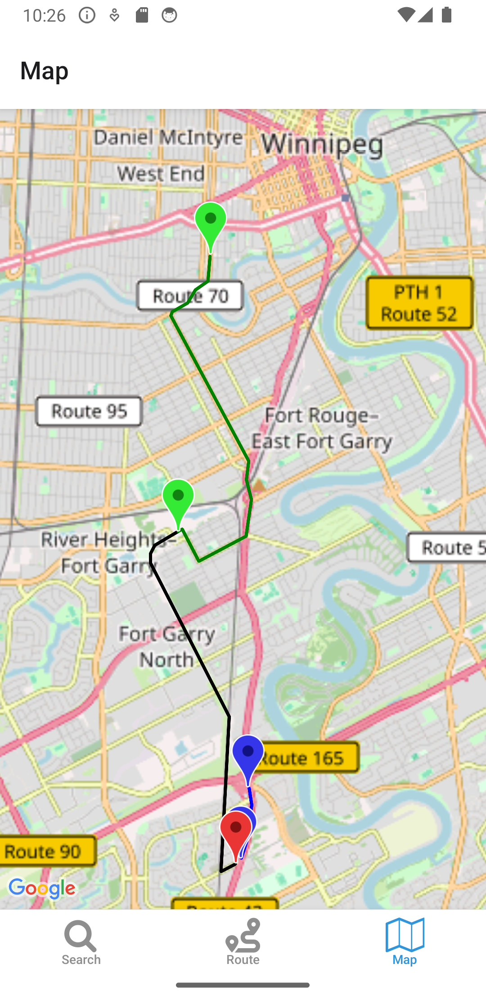

**Winnipeg Bus Trip Planner** is a cross-platform transit app designed to help commuters in Winnipeg easily plan, visualize, and navigate their bus routes. Built using React Native, this mobile app integrates with the Winnipeg Transit API and OpenStreetMap Overpass API to deliver real-time, interactive route planning with enhanced stop information and map visualizations.
### Key Features
🔍 Smart Trip Planning
- Input origin, destination, date, time, and travel mode to generate multiple route options.

- Automatically fetches and displays detailed trip plans using Winnipeg Transit’s official trip-planner API.

- Provide total **waiting time outside** and **sheltered time** for each trip to improve winter travel exprience. 

🗺️ Interactive Route Maps
- View the entire bus ride on a map, including bus lines, ride segments, and walk transfers.

- Routes are drawn using Polylines over OpenStreetMap tiles for high-accuracy visuals.

Each ride is highlighted with different colors for clarity.

🚏 Stop Shelter Detection
- Integrates Winnipeg Transit stop features to indicate if a stop has a:

    ✅ Heated Shelter

    🟦 Unheated Shelter

    ⛔ Unsheltered

 - Displays **shelter information** next to walking or transfer segments, improving comfort planning in harsh weather.

 WBTP is currently undergoing closed test in Google Play.

Web prototype version: https://github.com/pricezhang42/Commute-Compass-Vercel

